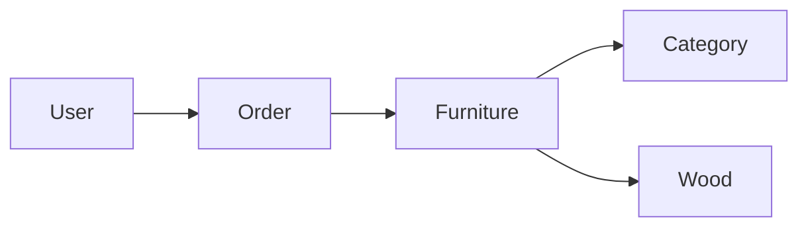

# 🪑 WoodCraft API


> A robust REST API for managing custom furniture orders, built with Node.js, Express, and MongoDB.

## ✨ Features

- 🔐 **JWT Authentication & Authorization**
  - Secure user registration and login
  - Role-based access control (User/Admin)
  - Token-based API protection

- 📦 **Product Management**
  - Comprehensive furniture catalog
  - Category organization
  - Wood type specifications
  - Stock management

- 🛒 **Order System**
  - Custom furniture orders
  - Real-time price calculation
  - Order status tracking
  - Delivery management

- 👥 **User Management**
  - User profiles
  - Role management
  - Access control
  - Profile customization

## 🚀 Getting Started

### Prerequisites

- Node.js ≥ 14.0.0
- MongoDB Latest
- npm or yarn

### Installation

1. Clone the repository
```bash
git clone https://github.com/yourusername/woodcraft-api.git
```

2. Install dependencies
```bash
npm install
```

3. Set up environment variables
```bash
cp .env.example .env
# Edit .env with your configurations
```

4. Start the server
```bash
npm run dev     # Development
npm start       # Production
```

## 🔧 API Structure

### Core Modules

- `📱 Auth` - User authentication and authorization
- `🪑 Furniture` - Furniture catalog management
- `🌳 Wood` - Wood types and specifications
- `📦 Orders` - Order processing and tracking
- `📁 Categories` - Product categorization

### Authentication


```http
Authorization: Bearer <your_jwt_token>
```

## 📚 API Documentation

Detailed documentation for each module:

- [Authentication](./auth.md)
- [Furniture Management](./furniture.md)
- [Order System](./order.md)
- [Categories](./category.md)
- [Wood Types](./wood.md)

## 🔒 Security Features

- ✅ JWT Authentication
- 🔐 Password Hashing (bcrypt)
- 🛡️ Role-Based Access Control
- 🚫 Rate Limiting
- 🔍 Input Validation
- 🛑 Error Handling

## 🌟 Status Codes


## 🛠️ Development

### Project Structure

```
src/
├── config/         # Configuration files
├── controllers/    # Route controllers
├── middlewares/    # Custom middlewares
├── models/         # Database models
├── routes/         # API routes
└── utils/         # Utility functions
```

### Running Tests

```bash
npm test           # Run all tests
npm run test:watch # Watch mode
```

## 📊 Data Models

### Core Entities



## 🤝 Contributing

1. Fork the repository
2. Create your feature branch
3. Commit your changes
4. Push to the branch
5. Open a Pull Request

## 📝 License

This project is licensed under the MIT License - see the [LICENSE](LICENSE) file for details.

## 🙏 Acknowledgments

- Express.js team
- MongoDB team
- Contributors & maintainers

---


