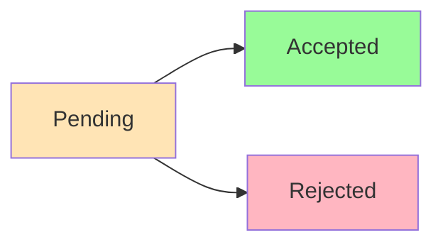
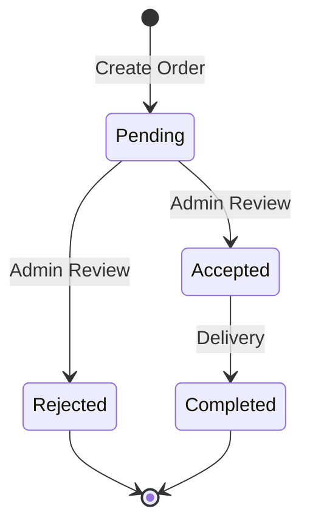
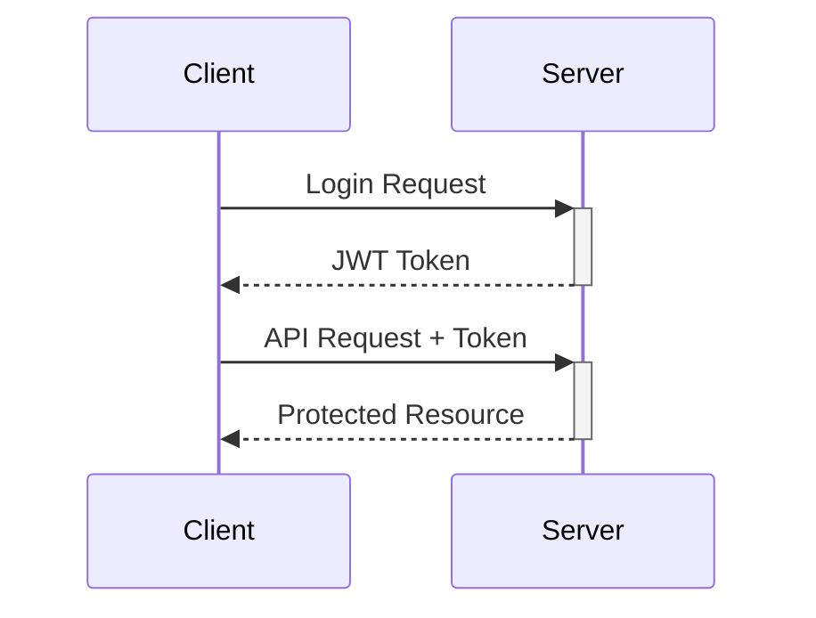

# 🛍️ Woodcraft API Documentation


## 📋 Order Management Endpoints

### User Endpoints

#### Create Order 🛒
```http
POST /api/orders
```


Create a new custom furniture order with specified items and wood types.

**Request Body:**
```json
{
  "items": [
    {
      "furniture": "furnitureId",
      "woodType": "woodTypeId",
      "quantity": 1
    }
  ]
}
```

#### View My Orders 📦
```http
GET /api/orders/my-orders
```


Retrieve all orders placed by the authenticated user.

#### Update Order ✏️
```http
PUT /api/orders/:id
```


Modify pending order details (items or description).

### Admin Endpoints

#### Get All Orders 📊
```http
GET /api/orders
```


Retrieve all orders in the system with complete details.

#### Get Accepted Orders ✅
```http
GET /api/orders/status/accepted
```


List all orders that have been accepted.

#### Get Rejected Orders ❌
```http
GET /api/orders/status/rejected
```


List all orders that have been rejected.

#### Update Order Status 🔄
```http
PUT /api/orders/:id/status
```


Change the status of an order (accept/reject) with required information.

**Request Body:**
```json
{
  "status": "accepted",
  "description": "Order confirmed",
  "deliveryDate": "2023-01-10T00:00:00.000Z"
}
```

## 🔒 Authentication Required

All endpoints require authentication using JWT token in the header:
```http
Authorization: Bearer <your_jwt_token>
```

## 📝 Response Formats

### Success Response Structure
```json
{
  "_id": "orderId",
  "status": "pending|accepted|rejected",
  "items": [...],
  "totalAmount": 100,
  "description": "Optional description",
  "deliveryDate": "2023-01-10T00:00:00.000Z",
  "createdAt": "2023-01-01T00:00:00.000Z"
}
```

### Error Response Structure
```json
{
  "error": "Error message description"
}
```

## 🎯 Status Codes

| Status Code | Description |
|-------------|-------------|
| 200 | ✅ Success |
| 201 | ✅ Created |
| 400 | ❌ Bad Request |
| 401 | 🔒 Unauthorized |
| 403 | 🚫 Forbidden |
| 404 | 🔍 Not Found |
| 500 | ⚠️ Server Error |

## 💡 Order Status Flow



## 📊 Order Lifecycle & Tracking

### Order States




### Status Indicators

#### Pending Orders

- Awaiting admin review
- Can be modified by user
- Cancelable

#### Accepted Orders

- Delivery date set
- Production started
- Cannot be modified

#### Rejected Orders

- Includes rejection reason
- No further actions allowed
- Archived after 30 days

### Timeline Events


1. Order Creation 📝
   - Timestamp recorded
   - Initial status set
   - Notification sent

2. Admin Review 👀
   - Review timestamp
   - Status update
   - Customer notification

3. Delivery Schedule 🚚
   - Date confirmation
   - Location verification
   - Customer notification

### User Notifications


| Event | Type | Channel |
|-------|------|---------|
| Order Created | 📧 | Email |
| Status Change | 📱 | Push |
| Delivery Update | 💬 | SMS |

### Admin Dashboard Indicators


- 🔴 Urgent Review Required
- 🟡 Pending Orders
- 🟢 Recently Accepted
- ⚫ Recently Rejected

## ⚙️ Technical Requirements

- Node.js >= 14.0.0
- MongoDB Latest
- Express 4.x
- JWT for authentication

## 🛒 Shopping Cart Guidelines

### Cart Structure


### Cart Operations

#### Add to Cart

```javascript
{
  "furniture": {
    "id": "furnitureId",
    "name": "Custom Chair",
    "basePrice": 100
  },
  "woodType": {
    "id": "woodTypeId",
    "name": "Oak",
    "priceMultiplier": 1.5
  },
  "quantity": 1
}
```

#### Remove from Cart

- Removes item by index
- Updates total amount automatically

#### Checkout Process


1. Cart Validation ✅
2. Price Calculation 💲
3. Order Creation 📝
4. Cart Clearing 🗑️

### Price Calculation


```
Final Price = Base Price × Wood Type Multiplier × Quantity
Total = Sum of all item prices
```

### Cart Persistence

- Cart data persists across page refreshes
- Clears after successful order placement
- Syncs across browser tabs

### Error Handling

- Stock availability check
- Wood type compatibility
- Quantity limits
- Price verification

## 🔍 API Validation & Response Codes

### Data Validation


### Response Status Codes

#### Success Responses


#### Client Error Responses


#### Server Error Responses


### Common Validation Rules

#### Order Items

```javascript
{
  "min_items": 1,
  "max_items": 10,
  "require_furniture": true,
  "require_wood_type": true
}
```

#### Quantity Validation

```javascript
{
  "min_quantity": 1,
  "max_quantity": 20,
  "integer_only": true
}
```

#### Date Validation

```javascript
{
  "delivery_date": "future_only",
  "format": "YYYY-MM-DDTHH:mm:ss.sssZ"
}
```

### Rate Limiting


### Security Headers

- CORS Policy
- XSS Protection
- CSRF Protection
- Content Security Policy

## 🔐 JWT Authentication

### Token Format


### Token Structure


```javascript
// Token Payload Structure
{
  "userId": "user_id",
  "role": "user|admin",
  "iat": "issued_at_timestamp",
  "exp": "expiration_timestamp"
}
```

### Authentication Flow




### Security Features


#### Token Usage
- 🔑 Include in Authorization header
- 🔄 Auto-refresh mechanism
- ⚠️ Blacklist for revoked tokens
- 🔒 Secure cookie storage

### Error Handling


| Error | Code | Badge |
|-------|------|-------|
| Invalid Token | 401 |  |
| Expired Token | 401 |  |
| Missing Token | 401 |  |
| Invalid Role | 403 |  |

# Order API Guide

## Components

### 1. Create Order
```javascript
// Request
POST /api/orders
Headers:
{
  "Authorization": "Bearer jwt.token.here"
}
Body:
{
  "furniture": "furnitureId",
  "quantity": 2,
  "shipping_address": {
    "street": "123 Main St",
    "city": "New York",
    "state": "NY",
    "zip": "10001",
    "country": "USA"
  },
  "payment_method": "credit_card"
}

// Response - Success (201)
{
  "success": true,
  "order": {
    "id": "orderId",
    "user": "userId",
    "furniture": {
      "id": "furnitureId",
      "name": "Classic Chair",
      "price": 199.99
    },
    "quantity": 2,
    "total_price": 399.98,
    "status": "pending",
    "shipping_address": {
      "street": "123 Main St",
      "city": "New York",
      "state": "NY",
      "zip": "10001",
      "country": "USA"
    },
    "payment_method": "credit_card",
    "created_at": "2023-01-01T00:00:00.000Z"
  }
}

// Response - Error (400)
{
  "error": "Invalid order details"
}
```

### 2. Get All Orders (Admin)
```javascript
// Request
GET /api/orders
Headers:
{
  "Authorization": "Bearer jwt.token.here"
}

// Response - Success (200)
{
  "success": true,
  "orders": [
    {
      "id": "orderId1",
      "user": {
        "id": "userId",
        "name": "John Doe"
      },
      "furniture": {
        "id": "furnitureId",
        "name": "Classic Chair"
      },
      "quantity": 2,
      "total_price": 399.98,
      "status": "completed",
      "created_at": "2023-01-01T00:00:00.000Z"
    },
    // ... more orders
  ]
}
```

### 3. Get User Orders
```javascript
// Request
GET /api/orders/my-orders
Headers:
{
  "Authorization": "Bearer jwt.token.here"
}

// Response - Success (200)
{
  "success": true,
  "orders": [
    {
      "id": "orderId",
      "furniture": {
        "id": "furnitureId",
        "name": "Classic Chair"
      },
      "quantity": 2,
      "total_price": 399.98,
      "status": "pending",
      "created_at": "2023-01-01T00:00:00.000Z"
    }
  ]
}
```

### 4. Get Single Order
```javascript
// Request
GET /api/orders/:id
Headers:
{
  "Authorization": "Bearer jwt.token.here"
}

// Response - Success (200)
{
  "success": true,
  "order": {
    "id": "orderId",
    "user": {
      "id": "userId",
      "name": "John Doe"
    },
    "furniture": {
      "id": "furnitureId",
      "name": "Classic Chair",
      "price": 199.99
    },
    "quantity": 2,
    "total_price": 399.98,
    "status": "pending",
    "shipping_address": {
      "street": "123 Main St",
      "city": "New York",
      "state": "NY",
      "zip": "10001",
      "country": "USA"
    },
    "payment_method": "credit_card",
    "created_at": "2023-01-01T00:00:00.000Z"
  }
}

// Response - Error (404)
{
  "error": "Order not found"
}
```

### 5. Update Order Status (Admin)
```javascript
// Request
PUT /api/orders/:id/status
Headers:
{
  "Authorization": "Bearer jwt.token.here"
}
Body:
{
  "status": "processing"
}

// Response - Success (200)
{
  "success": true,
  "order": {
    "id": "orderId",
    "status": "processing",
    // ... other order details
  }
}

// Response - Error (403)
{
  "error": "Not authorized to update order status"
}
```

### 6. Cancel Order
```javascript
// Request
PUT /api/orders/:id/cancel
Headers:
{
  "Authorization": "Bearer jwt.token.here"
}

// Response - Success (200)
{
  "success": true,
  "message": "Order cancelled successfully",
  "order": {
    "id": "orderId",
    "status": "cancelled",
    // ... other order details
  }
}

// Response - Error (400)
{
  "error": "Order cannot be cancelled"
}
```

## Implementation Notes

1. All order endpoints require authentication
2. Orders can only be created by authenticated users
3. Users can only view and manage their own orders
4. Admin users can view and manage all orders
5. Order status can only be updated by admin users
6. Orders can only be cancelled if they are in 'pending' status
7. Total price is automatically calculated based on furniture price and quantity

## Order Status Flow

1. `pending` → Initial state when order is created
2. `processing` → Order is being prepared
3. `shipped` → Order has been shipped
4. `delivered` → Order has been delivered
5. `cancelled` → Order has been cancelled
6. `completed` → Order has been completed

## Error Handling

Common HTTP Status Codes:
- 200: Successful operation
- 201: Order created successfully
- 400: Bad request (invalid input)
- 401: Unauthorized (invalid token)
- 403: Forbidden (insufficient permissions)
- 404: Order not found
- 500: Server error

## Security Features

1. Authentication Required
   - All endpoints require valid JWT token
   - Token must be included in Authorization header

2. Authorization Rules
   - Users can only access their own orders
   - Admin users can access all orders
   - Order status updates restricted to admin users

3. Data Validation
   - All required fields are validated
   - Quantity must be positive
   - Valid shipping address required
   - Valid payment method required